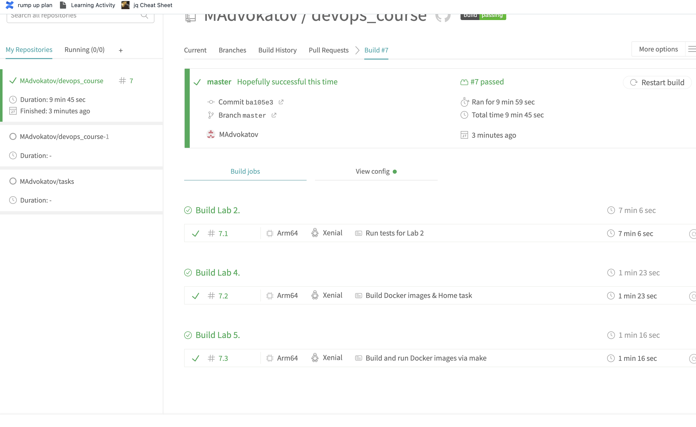

1. I have set up the integration with github.  

2. Checked the docs .

3. Added all repos to Travis .

4. Copied the .travis.yml file (also had to exclude it from the gitignore for hidden files . Just found that when I completed all of the tasks (better late than never) . 

5. Integrated with Docker as mentioned in the docs . Set 2 env variables which are going to be my username for docker and my pass for docker . 

6. 

Used " make all " to force a new build (of course I had to commit and push after that .

Rewrote the build for travis for lab4 as well so it can build a container for the monitoring app and also to push it to dockerhub as well .

- docker build -f Dockerfile.tests -t madvokatov/devops_course:django-monitoring .
- if [ "$TRAVIS_PULL_REQUEST" == "false" ]; then echo "$DOCKER_PASSWORD" | docker login -u "$DOCKER_USERNAME" --password-stdin; docker push madvokatov/devops_course:django-monitoring; else echo "PR skip deploy"; fi

Rewrote the travis file agian so the makefile in lab5 can upload the docker images for the containers built to dockerhub , just added :

script:
        - make docker-push

[Path to Travis](https://app.travis-ci.com/github/MAdvokatov/devops_course/builds)
